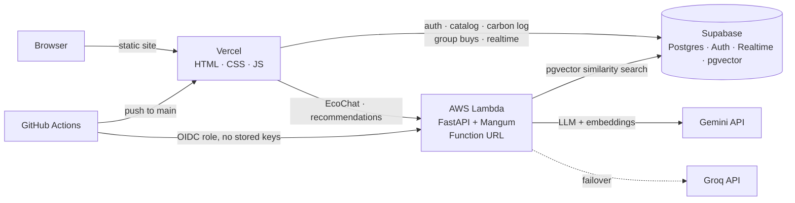

# 🌿 EcoCart — AI-Powered Sustainable E-Commerce Platform

> **Conscious commerce driven by explainable AI eco-grading, semantic (RAG) product swaps, and community group buying.**

**Live demo:** [ecocart-delta.vercel.app](https://ecocart-delta.vercel.app) &nbsp;·&nbsp; **API docs:** `/docs` on the deployed backend &nbsp;·&nbsp; **Cost to run: $0**

EcoCart helps shoppers make lower-carbon choices. Every product carries an explainable **A–F eco-grade** across five dimensions (materials, packaging, carbon, ethics, durability). A **RAG pipeline on Supabase `pgvector`** surfaces greener like-for-like alternatives, a personal **impact dashboard** turns purchases into real-world CO₂ equivalents, and **group buying** unlocks collective discounts with live progress.

---

## Architecture



**Request path for a greener swap (RAG):** the browser opens a product → FastAPI reads that product's **stored 768-d embedding** from Postgres → `match_products_in_group()` runs a cosine-similarity search inside the product's curated comparison group → results are filtered to *strictly higher* eco-grades. No LLM call is made at request time, so recommendations cost nothing and never hit a quota.

**Resilience:** chat tries Gemini, then Groq (optional), then a built-in rule engine, so the assistant always answers. Repeated questions are served from an in-memory cache, and chat is rate-limited per IP to protect free-tier quotas.

---

## Tech stack (100% free tier)

| Layer | Technology | Purpose |
|---|---|---|
| **Frontend** | HTML5, CSS3, vanilla JavaScript | Store, cart, impact dashboard, group buys, EcoChat |
| **Backend** | Python 3.12, FastAPI, Mangum | Async REST API, packaged for AWS Lambda |
| **Compute** | AWS Lambda + Function URL | Serverless backend, scales to zero (Always Free tier) |
| **AI / GenAI** | Gemini Flash-Lite, optional Groq (Llama 3.3) failover | EcoAdvisor chat and product grading |
| **Embeddings** | `gemini-embedding-001` (768-d) | Computed once per product, stored in Postgres |
| **Database & Auth** | Supabase (Postgres, Row Level Security, Auth) | Users, catalog, carbon log, group buys |
| **Vector search** | Supabase `pgvector` | Semantic similarity for greener swaps |
| **Real-time** | Supabase Realtime | Live group-buy membership |
| **IaC** | AWS SAM / CloudFormation | Reproducible Lambda deployment |
| **CI/CD** | GitHub Actions + OIDC | Test → lint → build → deploy → smoke-test |
| **Frontend hosting** | Vercel | Auto-deploys from `main` |

---

## Project structure

```
ecocart/
├── frontend/                   # Static client (deployed to Vercel)
│   ├── index.html
│   ├── styles.css
│   └── app.js                  # Supabase client + FastAPI client
├── backend/                    # FastAPI service
│   ├── app/
│   │   ├── main.py             # Routes, CORS, chat cache + rate limiting
│   │   ├── config.py
│   │   └── services/
│   │       ├── gemini_service.py   # Gemini -> Groq -> rule-engine failover, embeddings
│   │       └── vector_service.py   # pgvector RAG over stored embeddings
│   ├── lambda_handler.py       # AWS Lambda entrypoint (Mangum)
│   ├── scripts/                # embed_catalog.py, verify_rag.py, smoke_lambda_package.py
│   ├── tests/                  # 38 offline pytest tests
│   ├── requirements.txt
│   └── requirements-dev.txt
├── tests/frontend/             # jsdom tests for the client (auth, sessions)
├── supabase/                   # SQL: schema, RLS, pgvector, seed data
├── template.yaml               # AWS SAM template (Lambda + Function URL + log group)
├── infra/
│   └── github-oidc-bootstrap.yaml   # One-time: GitHub OIDC role + artifact bucket + spend alarm
├── .github/workflows/
│   ├── ci-cd.yml               # Test, lint, build, deploy, smoke-test
│   └── keep-alive.yml          # Keeps free tiers awake
└── render.yaml                 # Optional alternative backend host (Render free tier)
```

---

## Run locally

**Prerequisites:** Python 3.12+, a browser. A free [Gemini API key](https://aistudio.google.com) is optional (without it the app uses its rule engine).

```powershell
# Backend
cd backend
python -m venv venv
.\venv\Scripts\Activate.ps1
pip install -r requirements-dev.txt
copy .env.example .env        # then fill in your keys
uvicorn app.main:app --reload --port 8000
```

API at `http://localhost:8000` (Swagger UI at `/docs`, health at `/health`, database check at `/health/db`).

```powershell
# Frontend (second terminal)
cd frontend
python -m http.server 5500
```

Open `http://localhost:5500`. The client automatically targets `localhost:8000` when served from localhost.

**Embed the catalog** (once, after creating the Supabase project and running the SQL in `supabase/`):

```powershell
cd backend
python scripts\embed_catalog.py
python scripts\verify_rag.py     # every lower-grade product should list a greener match
```

---

## Testing

```powershell
cd backend
python -m pytest -q
```

Frontend auth tests (Node 24+): `cd tests/frontend && npm ci && npm test`.

38 backend tests run fully offline (no API keys, no network). They cover heuristic grading, the Gemini → Groq → rule-engine failover, the chat cache and rate limiter, CORS, pgvector recommendation logic, and the **AWS Lambda handler invoked with a real Function URL event**.

---

## CI/CD pipeline

`.github/workflows/ci-cd.yml` runs on every push and pull request:

| Stage | What it does |
|---|---|
| **Backend tests** | `pytest` on Python 3.12 |
| **Frontend checks** | `node --check`, plus 21 jsdom tests of login, signup, session restore and demo mode |
| **Infrastructure lint** | `cfn-lint` on `template.yaml` and the bootstrap template |
| **Build** | `sam build` packages the Lambda (Linux, Python 3.12) |
| **Package smoke test** | Imports the *built* package and invokes it with a Function URL event, before deploying |
| **Deploy** | `sam deploy` to AWS Lambda (only on `main`) using short-lived **OIDC credentials**, no access keys stored in GitHub |
| **Live smoke test** | Calls the deployed `/health`, verifies the CORS preflight for the Vercel origin, and checks `/health/db` |

The deploy job is skipped automatically until the AWS variables below are configured. The frontend is deployed by Vercel's Git integration on every push to `main`.

---

## AWS deployment (one-time setup, about 10 minutes)

The backend runs on **AWS Lambda behind a Function URL**. Lambda's Always Free tier (1M requests and 400,000 GB-seconds every month, permanently) covers this project, and the deploy role is scoped to this one stack.

**1. Create the bootstrap stack**
1. Sign in to the AWS console and select the region **Asia Pacific (Mumbai) `ap-south-1`** (or any region, but keep it consistent).
2. **CloudFormation → Create stack → With new resources → Upload a template file** and choose `infra/github-oidc-bootstrap.yaml`.
3. Stack name: `ecocart-bootstrap`. Leave the defaults. Put your email in **AlertEmail** to get a warning if the account is ever billed more than $0.10. If the stack fails because the GitHub OIDC provider already exists in your account, delete it and recreate it with **CreateOidcProvider = false**.
4. On the last page tick *"I acknowledge that AWS CloudFormation might create IAM resources with custom names"* and submit. Wait for `CREATE_COMPLETE`, then open the **Outputs** tab.

**2. Configure GitHub** (repository → Settings → Secrets and variables → Actions)

| Type | Name | Value |
|---|---|---|
| Variable | `AWS_ROLE_ARN` | `DeployRoleArn` output |
| Variable | `AWS_ARTIFACT_BUCKET` | `ArtifactsBucketName` output |
| Variable | `AWS_REGION` | `Region` output (e.g. `ap-south-1`) |
| Variable | `SUPABASE_URL` | Your Supabase project URL |
| Secret | `SUPABASE_SERVICE_ROLE_KEY` | Supabase secret (service role) key |
| Secret | `GEMINI_API_KEY` | Google AI Studio key |
| Secret *(optional)* | `GROQ_API_KEY` | Free key from console.groq.com |

**3. Deploy:** GitHub → Actions → **CI/CD** → **Run workflow** (or push to `main`). When it finishes, the run summary shows the live API URL.

**4. Point the frontend at it:** set `API_BASE_URL` in `frontend/app.js` to the Function URL, set the repository variable `BACKEND_URL` to the same URL (so the keep-alive job keeps Supabase awake), and push.

---

## Staying free forever

- **No idle costs:** Lambda bills only per request and sits inside the Always Free allowance. There is no server to keep awake.
- **Supabase never pauses:** the keep-alive workflow calls `/health/db` on a schedule. GitHub disables scheduled workflows after 60 days without repository activity, so re-enable it in the Actions tab if that ever happens.
- **AI quotas are protected:** recommendations read embeddings already stored in Postgres (zero LLM calls). Chat answers are cached for an hour and limited to 20 questions per IP per 10 minutes, with Groq as an automatic second provider.
- **Guardrail:** the optional spend alarm emails you if the AWS account is ever billed more than $0.10.
- **Account plan:** AWS requires a payment card at sign-up. Newer accounts start on a time-limited Free plan, so check your plan in the Billing console; moving to the standard plan costs nothing by itself and Always Free usage stays at $0.
- **Lambda scaling note:** the in-memory cache and rate limiter are per Lambda instance, so they are best-effort under heavy concurrency.

<details>
<summary>Alternative host: Render (free tier)</summary>

`render.yaml` deploys the same FastAPI app to a free Render web service (`rootDir: backend`, `uvicorn app.main:app --host 0.0.0.0 --port $PORT`). Set `GEMINI_API_KEY`, `SUPABASE_URL` and `SUPABASE_SERVICE_ROLE_KEY` in the dashboard. Render's free tier sleeps after 15 idle minutes; the keep-alive workflow pings it every 10 minutes to avoid cold starts.
</details>

---

## Key features

1. **Explainable AI eco-grading** — A–F grades across materials, packaging, carbon, ethics and durability, each with a plain-language explanation. Available live at `POST /api/ai/grade`, with a rule-based fallback.
2. **RAG greener swaps** — semantic similarity search over `pgvector` embeddings, restricted to comparable products and strictly better grades.
3. **EcoAdvisor chat** — a sustainability assistant with a Gemini → Groq → rule-engine failover.
4. **Personal impact dashboard** — EcoScore, real-world CO₂ equivalents and badges computed from purchase history.
5. **Group buying** — collective discounts with live progress via Supabase Realtime.
6. **Packaging choice at checkout** — per-choice CO₂ impact saved to the user's carbon log.
7. **Real accounts** — Supabase email/password auth with Row Level Security; users can only read and write their own data.

---

## Security

- **Row Level Security** on user-owned tables. Verified end to end for the carbon log: a signed-in user can insert their own rows but not another user's.
- **Secrets** live only in GitHub Actions secrets and Lambda environment variables. `.env` files are git-ignored, and a scan of the repository history found no secret keys.
- **Keyless deployment:** GitHub authenticates to AWS with OIDC. The deploy role can be assumed only by this repository's `main` branch and can manage only the `ecocart-backend` stack.
- **CORS** is restricted to the deployed frontend and localhost.
